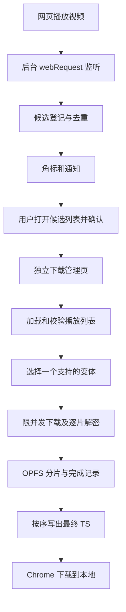

# v1 Chrome 扩展改造方案

## 1. 目标与依据

依据 [prd.md](./prd.md)、当前 Python 源码和此前讨论，将项目改造为纯 TypeScript / JavaScript 的 Chrome Manifest V3 扩展。

目标用户流程：安装扩展并允许网站访问 → 在网页播放视频 → 扩展自动发现 HLS 播放列表并提示 → 用户选择下载 → 自动下载、解密、合并并保存到本地。

本文件是实施设计，不代表扩展已实现。此次仅新增设计文档；Python 文件迁移及扩展开发在实施阶段进行。PRD 未指定的细节按本文方案作为 v1 默认设计。

### 1.1 v1 范围

- 不依赖 Python、Native Messaging、本地服务或远端下载服务。
- 自动识别可观察的 HTTP(S) `.m3u8` 请求及 HLS MIME 类型。
- 支持主播放列表和媒体播放列表；多清晰度选择一个变体下载。
- 支持已结束的点播列表、MPEG-TS 分片，以及音视频已复用在同一分片中的内容。
- 支持明文和标准 `METHOD=AES-128`、`KEYFORMAT=identity`，包括密钥切换、显式 IV 和媒体序号派生 IV。
- 提供候选列表、通知、进度、取消、失败重试和分片级恢复。
- 输出 `.ts` 文件，不把修改文件后缀当作 MP4 转换。

### 1.2 暂不支持

直播/未结束的 EVENT 列表、fMP4/`EXT-X-MAP`、`EXT-X-BYTERANGE`、独立音视频轨道合并、`EXT-X-DISCONTINUITY`、低延迟 HLS、SAMPLE-AES、DRM 和 MP4 转封装。检测到这些特征时应明确说明原因，不继续生成可能损坏的文件。

不承诺识别所有网页视频：请求发生在安装或授权之前、浏览器未暴露该请求、播放列表由脚本在内存中生成，或者资源已不可访问时，都可能无法发现或下载。安装后已开始播放的网页需要刷新或重新播放。

## 2. 当前代码评估与迁移

当前逻辑集中在 `hls/__init__.py`：

| 当前组件 | 原职责 | 改造后的归属 |
| --- | --- | --- |
| `BS` / `Get` | 注入资源获取方法，读取文本或字节 | 可注入的 `HttpClient`，便于离线测试 |
| `HLS` | 播放列表解析、URL 收集、密钥获取 | 无网络副作用的解析器 + 播放列表加载器 |
| `Decoder` / `AESDecoder` | 明文透传、AES-CBC 解密 | 每分片独立解密的 `SegmentDecryptor` |
| `Cache` | 分片落盘、跳过已有文件、合并 | OPFS 分片存储 + IndexedDB 完成记录 + 有序导出 |
| `MTDownloader` | 下载调度与会话管理 | 下载管理页中的 `DownloadEngine` |
| `tqdm` | 终端进度 | 弹窗摘要和下载管理页进度 |

必须修正的既有问题：

1. `download()` 的实际下载及合并逻辑被注释，当前只打印 URL。
2. 按后缀解析原始行会漏掉 CRLF、带查询参数及无扩展名的分片。
3. 子列表相对 URI 使用了父列表目录，多清晰度分片被混合。
4. 密钥属性按逗号及等号直接切分，无法正确处理引号中的特殊字符；子列表密钥被忽略。
5. CBC 解密对象跨分片复用，缺少默认 IV、逐分片密钥状态和正确的填充处理。
6. 按 URL 文件名缓存存在同名冲突，下载中断后的残留文件会被误认为完成。
7. 请求没有超时及重试，现有测试依赖外部地址和固定本机路径。

### 2.1 Python 文件归档

实施时将当前工作区内容原样迁入 `temp/`，保留未提交的用户修改：

| 现有路径 | 目标路径 |
| --- | --- |
| `hls/` | `temp/hls/` |
| `test/` | `temp/test/` |
| `setup.py` | `temp/setup.py` |
| `requirements.txt` | `temp/requirements.txt` |

原 README 安装说明保存到 `temp/README.md`，根 README 改为扩展开发和用户安装说明。`temp/` 纳入版本控制用于历史参考，但不进入扩展产物、TS 编译或新测试发现范围。不迁移或提交 `venv/`、缓存和 IDE 文件，不改变 `.git/`。若目标已存在，先比较内容，禁止直接覆盖。

## 3. 技术选型

| 层次 | 选择 | 原因 |
| --- | --- | --- |
| 扩展框架 | WXT + Manifest V3 | 管理入口、构建和扩展开发流程，保持 Chrome 原生 API 可见 |
| 语言 | TypeScript，开启 strict | 约束播放列表模型、任务状态和跨页面消息 |
| 界面 | 原生 HTML/CSS + TypeScript | v1 仅弹窗和下载页，先不增加 UI 框架 |
| 构建与包管理 | WXT 的 Vite 构建流程 + npm | 使用单一锁文件，便于复现 |
| 网络 | Fetch + AbortController | 超时、取消和有限重试 |
| 解密 | Web Crypto AES-CBC | 浏览器原生能力，无需引入 Python 加密依赖 |
| 存储 | chrome.storage + IndexedDB + OPFS | 分离设置、任务元数据和大体积分片 |
| 测试 | Vitest + Playwright/人工 Chrome 验证 | 纯逻辑离线测试和真实扩展行为验证 |

WXT 负责工程组织，不替代 Chrome 的权限和生命周期机制，见 [WXT 官方说明](https://wxt.dev/guide/introduction.html)。实际实施时选择相互兼容的稳定依赖版本，提交 `package-lock.json`，在 README 和 CI 固定已验证的 Node 版本；不在此文档猜测版本组合。

## 4. 运行架构



### 4.1 后台 Service Worker

- 在后台入口同步注册请求、通知、标签页和下载事件监听，回调内部异步加载状态。
- 负责发现、候选列表、角标、通知和打开管理页，不执行整个长视频下载循环。
- 不依赖全局变量持久存在；设置存入 `chrome.storage.local`，候选及导航代次存入 `chrome.storage.session`。
- 请求事件通过存储事务或串行更新队列去重，防止并发覆盖。

Chrome 可终止闲置或超时的扩展 Service Worker；持久化状态是必要设计，而不是通过定时心跳强行保活。参见 [生命周期文档](https://developer.chrome.com/docs/extensions/develop/concepts/service-workers/lifecycle)。

### 4.2 弹窗和下载页

- 弹窗只呈现当前标签页候选列表及任务摘要，关闭弹窗不影响下载。
- 下载管理页是扩展自己的标签页，用户点击下载后自动打开并开始加载任务。
- 管理页负责网络、解密、存储和导出；v1 要求任务期间保持此页打开。
- 关闭源视频网页通常不影响已经开始的任务，但登录态或链接失效仍可能导致失败。
- 关闭管理页或浏览器会中断任务。重新打开时显示“已中断，可恢复”，不承诺关闭 Chrome 后继续下载。
- 浏览器冻结或丢弃标签页同样按中断恢复处理。
- v1 同时只运行一个视频任务，其余排队；任务写入使用 Web Locks 排他锁，防止多个管理页重复执行。

不把 offscreen document 当作通用永驻后台。若后续要求关闭管理页后继续运行，另行设计和验证生命周期，不改变 v1 的承诺。

## 5. 权限和请求发现

### 5.1 权限配置

建议由 WXT 配置生成以下权限：

```json
{
  "manifest_version": 3,
  "permissions": ["webRequest", "storage", "downloads", "notifications"],
  "host_permissions": ["http://*/*", "https://*/*"]
}
```

全站 HTTP(S) 主机权限对应 PRD 的“安装后自动发现网页请求”，同时覆盖网页与跨域 CDN。若用户将网站访问限制为点击时或特定站点，只能发现获授权范围内的新请求，并在界面说明。后续可增加按站点授权模式，但它不具备默认全站自动发现能力。

v1 不申请 `webRequestBlocking`、`debugger`、`cookies`、`scripting` 或 `unlimitedStorage`。读取当前页候选采用 `tabs.query` 获取 ID；必要的标题/URL 仅在已有主机权限允许时读取，读取失败用通用名称，不为此默认扩大权限。

Manifest V3 支持非阻塞 `webRequest` 监听，子资源观察需要同时具有请求目标及发起方权限，见 [webRequest 文档](https://developer.chrome.com/docs/extensions/reference/api/webRequest)。

### 5.2 检测和去重

1. 监听 `onBeforeRequest` 记录路径以 `.m3u8` 结尾的候选，使用 `new URL(url).pathname`，大小写不敏感；完整 URL 必须保留查询参数。
2. 监听 `onHeadersReceived`，通过去除参数后的 MIME 类型 `application/vnd.apple.mpegurl`、`application/x-mpegurl` 补充检测。不要仅过滤 `media` 请求，因为播放器可能用 fetch/XHR。
3. 用请求 ID 跟踪重定向和状态，记录最终 URL；HTTP 错误显示不可用状态，不提示已可下载。
4. 排除 `tabId < 0`、本扩展发起的请求和管理页标签，避免自行发现自身下载。
5. 候选身份由 `tabId + navigationEpoch + 完整URL` 构成。不能删除 token 等查询参数来强行合并不同资源。
6. 同一导航内相同 URL 仅更新最后发现时间，不重复通知。后台通过顶层主框架请求和标签页事件维护导航代次；关闭标签页清除候选，已创建任务独立保留。
7. 在尚未读取正文时只把它称为“候选播放列表”，不能仅凭域名认定多个列表是同一个视频。用户确认后才能按解析得到的主子列表关系归组。

默认每个标签页每次导航首次发现时通知一次，后续仅更新角标；对 SPA 的后续新候选采用可配置冷却时间。候选设置数量上限和过期时间，例如每标签页 100 条、闲置 30 分钟过期。

### 5.3 提示与确认边界

- 角标显示候选数量；系统通知说明“发现可能的视频，点击查看”。系统通知不可用时，角标仍正常工作。
- 点击通知只打开候选列表；点击明确的“下载”按钮才授权创建下载任务。
- 用户确认前只观察已经发生的请求和响应头，不主动请求播放列表、密钥或视频分片。
- 确认后，默认选择最高分辨率的受支持变体（分辨率相同时按带宽排序），并提供可选的清晰度选择模式。不得拼接不同变体。
- 同一候选重复点击返回已有活动任务；已完成任务允许显式重新下载。

## 6. 播放列表解析与网络策略

### 6.1 模块边界

`parsePlaylist(text, baseUrl)` 只解析并返回模型，不联网。`PlaylistLoader` 负责 fetch、重定向后的 URL、变体选择、密钥加载和支持范围检查。`HttpClient` 可注入测试实现。

解析器至少处理：`EXTM3U`、`EXT-X-STREAM-INF`、`EXTINF`、`EXT-X-MEDIA-SEQUENCE`、`EXT-X-KEY`、`EXT-X-ENDLIST`，并识别范围外标签后给出明确错误。

- 使用 `split(/\r?\n/)` 和行首尾空白处理；属性列表采用理解引号的扫描器，不能直接 `split(',')` 或无界 `split('=')`。
- 根据标签上下文判断 URI 用途，不依赖 `.ts` 扩展名。
- 相对 URI 使用 `new URL(uri, response.url)`，主列表、子列表和密钥各自使用所属列表基准。
- 保留 URI 自身查询参数，但不擅自把父列表 token 追加到所有子资源。
- 建立访问集合和深度上限，例如 5 层，检测循环、空列表及无效清单。
- `EXT-X-MEDIA` 引用外部音频的变体不自动忽略音轨，应判定该变体不支持。
- v1 仅下载带 `EXT-X-ENDLIST` 的完整列表，遇到不支持的类型在批量下载前失败。

分片和密钥状态按 HLS 标签作用范围绑定，协议依据见 [RFC 8216](https://www.rfc-editor.org/rfc/rfc8216.html)。

### 6.2 请求规则

- 从扩展管理页发起 fetch，保留签名 URL；尝试 `credentials: 'include'` 使用浏览器允许的凭证行为。
- 主机权限解决扩展跨域访问资格，但不保证站点认证成功。v1 不复制 Cookie、不记录 Authorization、不承诺模拟原始 Referer/Origin。
- 401/403 停止并提示刷新源网页后重新发现；404 和解析/解密错误不自动重试。
- 网络错误、超时、408、429 和可重试 5xx 最多额外重试 3 次，指数退避加抖动，尊重合理的 `Retry-After` 并设置最大等待上限。
- 默认请求总超时 30 秒，覆盖响应头及正文读取；取消、超时后必须终止请求并清理计时器。
- 播放列表正文设置上限，例如 2 MiB；分片设置上限，例如 64 MiB，读取过程中累计检查，不能只相信 Content-Length。
- 所有外部 URI 只允许 HTTP(S)，重定向后同样检查。错误和日志隐藏查询参数，不输出密钥。

## 7. 下载、解密和文件保存

### 7.1 分片调度

默认分片并发数为 4。队列按媒体顺序生成，但完成顺序可以不同。每个分片具备独立状态，只有完整下载、成功解密并关闭持久化写入后才记为完成。

以 `taskId + playlistFingerprint + segmentIndex` 定位缓存，避免不同路径同名资源冲突；不能通过“文件存在”判断成功。遇到致命错误中止其他请求，不导出缺片文件。

### 7.2 AES-128

- 密钥必须为 16 字节；同一密钥声明可共享一次加载结果，新的密钥声明创建新的上下文，避免仅按 URI 永久复用内容。
- 有显式 IV 时校验并左补零到 16 字节；无 IV 时取媒体序号加分片索引，使用 BigInt 编码为 128 位大端数。
- 每个分片单独调用 `crypto.subtle.decrypt`，不跨分片保留 CBC 状态。
- Web Crypto 的 AES-CBC 解密处理 PKCS#7 填充，调用方不得再次去填充；失败视为解密错误。
- `METHOD=NONE` 清除后续分片的加密状态；不支持的 METHOD/KEYFORMAT 立即拒绝。
- 原始密钥只在任务内存中保留，恢复时重新获取，不写日志或长期配置。

API 参考：[SubtleCrypto.decrypt](https://developer.mozilla.org/en-US/docs/Web/API/SubtleCrypto/decrypt)。

### 7.3 存储与导出

分片数据存入 OPFS；任务、分片长度及完成状态存入 IndexedDB。OPFS 是扩展来源的私有存储，不是用户下载目录，受配额限制，见 [OPFS 文档](https://developer.mozilla.org/en-US/docs/Web/API/File_System_API/Origin_private_file_system)。

写入采用临时分片文件；写入成功关闭后再提交完成记录。崩溃残留的临时文件可删除，只有数据库完成记录且文件长度一致的分片可恢复复用。无需假设 OPFS 文件操作与 IndexedDB 是跨存储原子事务。

全部分片完成后，按索引读取并顺序写入 OPFS 最终 `.ts` 文件，限制单次读写缓冲，禁止将整个视频收集为一个内存 `Uint8Array`。从最终文件获取 File/Blob URL，再通过 `chrome.downloads.download` 导出，默认 `saveAs: false`，服从用户 Chrome 下载设置；用户可以选择另存为。

记录 `downloadId`，监听下载完成/中断。API 返回 ID 只表示已启动导出，不能标记任务成功。完成后释放 Blob URL 和临时数据；导出失败保留最终文件供重试。管理页需要保持打开直到导出完成，页面关闭后需重新创建 Blob URL。参见 [downloads API](https://developer.chrome.com/docs/extensions/reference/api/downloads)。

v1 不承诺无限大小：持续调用存储容量估算并处理实际配额错误；合并阶段可能需要同时容纳全部分片和最终文件。空间不足时明确失败，不继续部分导出。大文件的 Blob URL 导出必须在真实 Chrome 中验证，不能仅用单元测试推断内存占用。

### 7.4 恢复和清理

- 管理页启动时发现未完成的活动任务，将其标为 `interrupted`；实际恢复必须先获得任务排他锁。
- 用户点击恢复后重新加载播放列表，比较分片顺序、完整 URI、序号和加密声明指纹。一致才复用缓存；不一致提示新建任务。
- 有效 URL 相同也不保证服务器内容永远不变，恢复按点播资源稳定性假设执行；不宣称字节级强一致快照。
- 已完成分片无需重新解密；未完成分片重新下载。v1 不做单分片 Range 续传。
- 取消立即 abort 队列，释放锁并清理任务文件；失败/中断保留缓存，提供显式清理操作，并在下次管理页启动时清理过期任务，例如 7 天。

## 8. 数据模型、状态与消息

```ts
type TaskStatus =
  | 'queued' | 'resolving' | 'downloading' | 'merging' | 'exporting'
  | 'completed' | 'failed' | 'cancelled' | 'interrupted';

interface Candidate {
  id: string;
  tabId: number;
  navigationEpoch: string;
  url: string;
  finalUrl?: string;
  detectedBy: 'url' | 'mime' | 'both';
  firstSeenAt: number;
  lastSeenAt: number;
}

interface Segment {
  index: number;
  sequence: string; // 十进制字符串；计算 IV 时转为 BigInt
  url: string;
  duration: number;
  keyContextId?: string;
  ivHex?: string;
}

interface DownloadTask {
  id: string;
  candidateId: string;
  playlistUrl: string;
  selectedVariantUrl?: string;
  playlistFingerprint?: string;
  status: TaskStatus;
  completedSegments: number;
  totalSegments: number;
  downloadedBytes: number;
  outputName: string;
  downloadId?: number;
  updatedAt: number;
  error?: { code: string; message: string; retryable: boolean };
}
```

正常状态：`queued → resolving → downloading → merging → exporting → completed`。非终态可以失败、取消或被中断；重试从重新校验资源开始，导出失败可直接重试导出。

跨组件消息使用带 `type` 的联合类型：`LIST_CANDIDATES`、`START_TASK`、`LIST_TASKS`、`CANCEL_TASK`、`RETRY_TASK`、`TASK_UPDATED`。命令返回结构化成功/错误，使用请求 ID 去重。校验 sender 属于本扩展及消息字段；START_TASK 通过内部候选 ID 查找目标，避免任意网页传入 URL 触发下载。

进度展示已完成分片数/总数、已下载字节及当前阶段；服务器没有提供总大小时不伪造字节百分比。进度消息节流，例如每 250 毫秒最多更新一次；存储提交按分片完成而非每个网络 chunk 触发。

## 9. 目录设计

```text
.
├── docs/v1/{prd.md,dev.md}
├── temp/                      # 原 Python 源码与说明
├── entrypoints/
│   ├── background.ts          # 请求发现、通知和任务协调
│   ├── popup/
│   │   ├── index.html
│   │   └── main.ts
│   └── manager/
│       ├── index.html
│       └── main.ts
├── src/
│   ├── detection/             # 候选、去重、导航代次
│   ├── hls/                   # 解析、模型、变体和支持检查
│   ├── network/               # fetch、超时、重试
│   ├── download/              # 调度、任务状态、解密
│   ├── storage/               # 元数据、OPFS、恢复和清理
│   ├── export/                # 顺序合并、Chrome 下载
│   ├── shared/                # 消息、错误、类型
│   └── ui/                    # 公共样式和视图逻辑
├── public/icon/
├── tests/
│   ├── unit/
│   ├── integration/
│   ├── e2e/
│   └── fixtures/              # 自有/合成播放列表与视频样本
├── wxt.config.ts
├── tsconfig.json
├── package.json
├── package-lock.json
└── README.md
```

## 10. 实施阶段与交付

### 阶段一：迁移与基础工程

原样归档 Python 文件；建立 WXT + TS、图标、弹窗及管理页；配置权限和开发脚本。先完成 Chrome 中 OPFS 写入、File URL 导出及权限观察的最小验证，确定最低支持 Chrome 版本并写入 manifest/README。

### 阶段二：发现和确认

实现 URL/MIME 检测、导航隔离、去重、角标、通知和确认入口。使用本地可控网页及第二个来源模拟跨域 CDN。验收未确认时无扩展主动媒体请求。

### 阶段三：明文点播闭环

实现解析、单变体选择、4 路并发、OPFS 缓存、有序合并和导出；跑通从网页播放到本地可播放 TS 的流程。

### 阶段四：加密与恢复

加入 AES-128、密钥切换、默认 IV、超时重试、取消、中断恢复、配额失败及缓存清理。

### 阶段五：验证与打包

完成自动化检查和真实 Chrome 验收，补充用户说明及范围限制，生成扩展构建目录和分发 zip。商店发布是后续独立动作，本方案不包含自动提交商店。

建议脚本：`npm run dev`、`npm run build`、`npm run zip`、`npm run typecheck`、`npm run lint`、`npm test`、`npm run test:e2e`，由实施时的 package.json 明确定义。

## 11. 测试与验收标准

自动化测试使用本地 fixtures 和模拟服务器，不依赖当前 Python 测试中的外部视频地址。

| 场景 | 验收结果 |
| --- | --- |
| 安装、授权、网页播放 | 在可观察请求后更新候选和角标，通知可点击 |
| 未确认、重复检测 | 不主动下载媒体；同一候选不重复通知或创建任务 |
| URL token、CRLF、无后缀 MIME | 正确检测和解析，查询参数不丢失 |
| 重定向、嵌套相对路径 | URI 相对最终所属列表解析 |
| 多清晰度、相同文件名 | 只下载选中变体，不发生缓存覆盖 |
| 引号内逗号/等号、空列表、循环列表 | 正确解析或产生明确错误，不无限请求 |
| 明文及 AES-128 | 输出字节与参考 TS 一致，覆盖显式/默认 IV、密钥切换和 METHOD=NONE |
| 不支持的 HLS 特征 | 批量下载前拒绝，不输出伪成功文件 |
| 分片乱序、网络中断、429 | 最终顺序正确，遵循有限重试，不复用半成品 |
| 401/403、链接过期 | 显示可理解错误，不无限重试 |
| 关闭弹窗/后台重启 | 管理页任务不受弹窗影响，候选状态可恢复 |
| 关闭管理页/重启浏览器 | 显示中断；重新校验后按分片恢复 |
| 两个管理页、快速重复点击 | 同一任务仅一个执行者 |
| 取消、磁盘或配额不足 | 请求停止，任务状态准确，缓存可清理 |
| 导出中断、另存为取消 | 不标记 completed，可重新导出 |
| 大文件 | 至少用 1 GiB 合成 TS 验证流式合并和实际导出，记录浏览器版本、峰值内存和额外磁盘占用 |

采用 Vitest 覆盖解析、队列、状态和错误行为；用浏览器集成测试验证 Web Crypto、IndexedDB、OPFS 和扩展 API。系统通知展示、用户限制网站权限、保存对话框、浏览器丢弃标签页及最终播放器兼容性进行真实 Chrome 人工验收，不能以 mock 结果替代。

最终交付要求：构建、类型检查、必要测试通过；扩展能在无 Python 环境加载；用户无需复制 m3u8 地址即可完成发现、确认和保存；README 明确授权方式、保持管理页打开、支持格式和恢复限制。

## 12. 实施记录

2026-09-12 已按本方案实现 v1 主流程。本节保留 v1 实施时的状态；当前支持范围、安装方式及验证命令见 [README](../../README.md)。最低 Chrome 版本按实际验证设为 134；清晰度界面首版提供最高/最低可用策略；导出逻辑暂与下载引擎合并组织。
