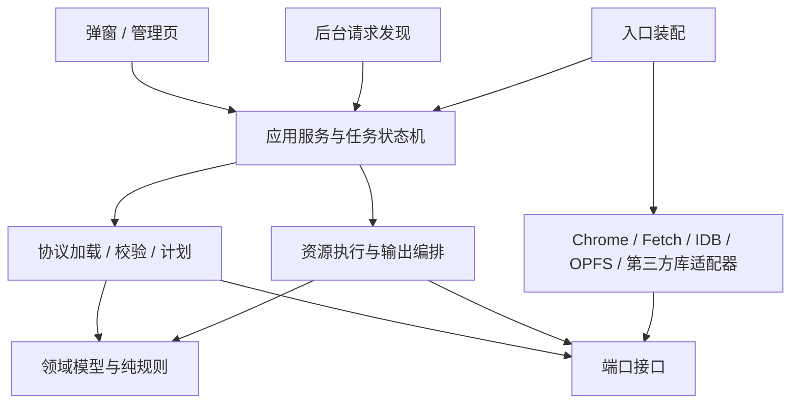

# HLS 下载器 v2 开发方案

## 1. 依据、结论与范围

本方案基于当前 TypeScript 实现、[v2 PRD](prd.md)和 [v1 设计](../v1/dev.md)，编写于 2026-09-12。

路径说明：v2 需求与开发方案位于 `docs/v2/`；当前支持范围、安装方式及验证命令统一见 [README](../../README.md)。

PRD 要求按 HLS 协议完善下载器，并评估是否使用成熟实现库。它没有要求 v2 一次性实现全部 HLS、直播和 DRM。本方案将“协议差距清单”与“本版交付承诺”分开：先可靠覆盖常见的已结束资源，再通过明确接口扩展其他模式。

核心决策：

1. 使用 `m3u8-parser` 作为播放列表解析适配器的首选实现；它不是官方认证的完整协议实现，不能替代业务校验和兼容性判断。
2. 将流程拆为 **解析 → 规范化 → 协议校验 → 能力判断 → 下载计划 → 资源执行 → 媒体输出 → 导出**。
3. 保留 WXT、TypeScript strict、管理页执行任务、OPFS/IndexedDB 和浏览器原生 AES-CBC；不增加 Python 或下载服务器。
4. v2 核心交付：完善现有 TS 下载，增加字节范围、变量 URI、初始化资源、受约束的 fMP4 输出及逐变体可用性判断；所有支持承诺由 fixtures 和真实媒体校验约束。
5. 独立音视频轨道合流、持续直播、完整 LL-HLS、样本加密/DRM 和通用转码留作后续独立能力，不通过忽略标签来伪装支持。

本方案现已进入实现。当前支持范围与限制见 [README](../../README.md#支持范围)，验证方式见 [开发与验证](../../README.md#开发与验证)；下文保留原设计依据，不能把设计中的扩展点等同于已经启用的功能。

## 2. 协议参照与“完整支持”的定义

以 [RFC 8216](https://www.rfc-editor.org/rfc/rfc8216.html) 为基线；扩展特性参照 [HLS 2nd Edition 草案](https://datatracker.ietf.org/doc/draft-pantos-hls-rfc8216bis/)。本次查看的草案页面为 `-22`；草案不是已发布 RFC，实施时把实际采用的文档版本、条款编号与 fixture 一起记录。

不再使用一个 `supported: boolean` 代表全部能力。每个特性分别标记：

| 层次 | 要回答的问题 |
| --- | --- |
| 能识别 | 解析器能否保留标签、属性、作用范围与来源位置？ |
| 合法 | 文本和标签组合是否符合选定的规范版本？ |
| 能下载 | 当前网络、加密和资源执行器能否取得需要的数据？ |
| 能输出 | 是否存在可靠的容器输出策略，能保存完整选中内容？ |
| 已验证 | 哪些具体编码、封装及场景已有真实媒体证据？ |

播放器的自适应播放、低延迟追帧和字幕呈现，不自动变成离线下载器必须实现的功能；但影响媒体完整性的初始化段、轨道和时间线信息不能丢失。协议正确性与浏览器播放兼容性也要分别报告。

## 3. 当前实现与协议差距

以下是源码审查结论，不是新增测试结果。

### 3.1 协议能力矩阵

| 能力 | 当前实际行为 | 差距与影响 | v2 决策 |
| --- | --- | --- | --- |
| 主/媒体列表 | 用 `variants`、`segments` 两个数组表示 | 无判别类型；可出现语义含糊状态 | 分开模型 |
| 文本与标签 | 手写属性正则和标签分支；修剪空白、移除 BOM | 宽容解析未产生诊断；未知标签信息丢失 | 成熟解析适配器 + 原文诊断 |
| 版本与时长 | 不校验 VERSION/TARGETDURATION | 无法区分不合法清单与能力不支持 | 规则化校验 |
| 媒体序号 | 字符串和 BigInt，默认 IV 正确 | 未统一约束协议整数范围 | 保留精度并加边界校验 |
| 主列表变体 | 按高度、带宽排序 | CODECS、帧率、音轨关系没有完整建模 | 保留完整选择信息 |
| 变体回退 | 只过滤外部音轨；选中后加载 | 最优子列表不支持时直接失败 | 探测候选，再按策略选择 |
| 结束列表 | 强制存在 ENDLIST | 不区分 VOD、EVENT、已结束直播的描述信息 | 解析保留类型；本版执行仍要求结束 |
| BYTE-RANGE | 遇到标签就抛错 | 不支持一个文件中的多个分片 | 纳入核心范围 |
| MAP / fMP4 | 遇到标签就抛错；执行器固定检查 TS | 缺少初始化资源和容器输出策略 | 纳入受约束范围 |
| AES-128 | 逐分片解密，支持 IV 和密钥切换 | 不处理 MAP 密钥状态、会话密钥、多个 KEYFORMAT 的选择 | 扩展密钥模型与验证 |
| METHOD=NONE | 清除后续 key | 不检查非法属性组合 | 纳入校验 |
| SESSION-KEY | 一律拒绝 | 不能利用主列表提供的密钥信息 | identity/AES-128 场景有条件支持 |
| DEFINE / 变量 | 一律拒绝 | 导入变量或查询变量 URI 无法解析 | 按固定扩展规则支持 |
| 独立音频/视频 | 只粗略排除外部音频 | 没有多轨时间轴、语言选择与合流 | 完整识别，暂不合流 |
| WebVTT / Packed Audio | 非 TS 内容会在下载后失败 | 缺少各自输出器 | 明确报告未支持 |
| DISCONTINUITY | 一律拒绝 | 不支持时间线/参数切换 | 默认拒绝；独立时间段输出有条件支持 |
| GAP | 一律拒绝 | 无完整性策略 | 识别缺片，完整下载默认拒绝 |
| PDT / DATERANGE | 信息被忽略 | 时间信息及业务元数据无法保留 | 保留元数据，不赋予未经实现的行为 |
| I-frame-only | 一律拒绝 | 不能下载技巧播放资源 | 识别并排除，不当正片 |
| SAMPLE-AES / DRM | 非 AES-128 拒绝 | 样本加密和授权系统未实现 | 保持明确拒绝 |
| Live / LL-HLS | 未结束或相关标签直接拒绝 | 无持续刷新、part 合并、窗口恢复 | 单独后续版本 |
| Content Steering 等扩展 | 部分未知标签会被忽略 | 可能遗漏影响资源选择的语义 | 建立明确扩展能力表 |

条款定位：基础标签、媒体与主列表语义见 RFC 8216 §4；媒体类型见 §3；密钥见 §5；刷新和客户端下载规则见 §6。变量、part、steering 等不能笼统归入 RFC 8216 原始标签集合。

### 3.2 工程差距与代码依据

| 位置 | 当前问题 | 重构要求 |
| --- | --- | --- |
| [parser.ts](../../src/hls/parser.ts) | 解析时直接执行产品范围拒绝 | 合法性和执行能力分开 |
| [loader.ts](../../src/hls/loader.ts) | 网络加载、变体选择和解析耦合 | 通过注入的 transport 产生可审查计划 |
| [engine.ts](../../src/download/engine.ts) | 同时处理调度、AES、格式判断、存储、导出、锁和恢复 | 执行编排不直接依赖 Chrome/OPFS |
| [model.ts](../../src/shared/model.ts) | 候选、协议和任务模型混在一起；单个输出文件假设 | 按领域拆开，支持多资源/多产物 |
| [http.ts](../../src/network/http.ts) | 完整缓冲每个响应；不返回状态/实体校验器/范围元数据 | 区分小对象读取与资源流式执行 |
| [files.ts](../../src/storage/files.ts) | 缓存路径只有任务和片号；固定 TS 合并 | 资源身份包含轨道、范围、初始化与加密上下文 |
| [db.ts](../../src/storage/db.ts) | 任务整行覆盖，无 schema/修订号；完成片只有长度 | CAS 状态转换、迁移与完整性记录 |
| [background.ts](../../entrypoints/background.ts) | 注册监听、状态、通知、任务创建同处入口 | 入口只装配适配器和订阅 |
| [manager/main.ts](../../entrypoints/manager/main.ts) | UI 直接写任务状态、操作文件和锁 | UI 只发命令、订阅读模型 |
| 恢复路径 | 对整个解析对象 JSON 求指纹；字段变化即不兼容 | 稳定、显式版本化的语义快照 |
| 测试 | 24 项单测与合成 TS 端到端 | 补齐媒体语义、适配器契约、真实轨道与升级测试 |

已有正确基础不重写：确认前不主动下载、URI 基准处理、逐片 AES、完成记录后复用缓存、有限重试、取消和真实 Chrome 导出继续作为回归基线。

已有 1.01 GiB 测试证明文件字节闭环，不证明完整媒体标准兼容。其浏览器 RSS 合计约 1.37 GiB，也不能用约 6.33 MiB 的 JS 堆读数宣称总内存恒定。

## 4. v2 交付边界

### 4.1 必须交付

- 模块拆分和可注入端口；入口/UI 不再直接写数据库或调用加密、合并逻辑。
- 成熟解析适配器、带位置的诊断、规范化模型和显式规则表。
- 保持普通 TS + AES-128 的 v1 回归；完善资源完整性和恢复验证。
- 主列表变体清单与探测结果；最高/最低自动回退和用户指定变体两种模式。
- 完整分片对应的显式/隐式字节范围下载，严格检查 HTTP 响应。
- DEFINE 的 NAME/VALUE、IMPORT、QUERYPARAM 子集，在固定扩展版本下验证；无静默替换。
- MAP 初始化资源；同轨道结构、初始化兼容、时间线连续的 fMP4 保存。
- 对超出本版输出范围的资源给出结构化原因，而非下载一半才报“不是 TS”。
- v1 数据升级、崩溃恢复、跨页面命令幂等和兼容性 fixture 库。

### 4.2 有条件交付的组合

- 加密 MAP：仅 identity/AES-128 且具备合法显式 IV，经独立 fixture 验证。
- SESSION-KEY：识别和校验主列表的 identity/AES-128 密钥描述；以媒体列表实际作用域为准，不把会话密钥自动套给全部分片。
- 不连续列表：仅在每个时间段可独立初始化、解码且用户接受多个输出文件时启用。必须在确认计划中说明产物数量；否则拒绝。
- fMP4：必须确认 `moof`/`mdat`、track ID、数据偏移、初始化和解码时间满足所选输出器前提。只识别到 MAP 不代表能输出 MP4。

### 4.3 本版不承诺

独立音视频合流、通用时间戳修复、TS 转 MP4、WebVTT/纯音频独立输出、直播录制、完整 LL-HLS、Content Steering 的动态服务切换、I-frame 特殊 CBC 范围规则、SAMPLE-AES/DRM、转码，以及 Chrome 关闭后继续下载。

这些不是从差距表中消失的功能：能力注册表必须返回 `recognized-but-not-executable`，界面显示原因。后续实现使用已有 track/timeline/output 接口，不扩张一个总开关或巨大条件分支。

## 5. 成熟库选型

### 5.1 候选评估

| 候选 | 适合承担的职责 | 本项目决策 |
| --- | --- | --- |
| `videojs/m3u8-parser` | 播放列表解析、媒体组、MAP/range/变量等结构提取 | 首选解析适配器，须通过准入测试 |
| `video-dev/hls.js` | 浏览器播放、MSE、播放加载和缓冲策略 | 可做独立播放验证工具；不作为下载引擎 |
| `videojs/mux.js` | TS 等容器处理、transmuxing 工具 | 后续 TS→fMP4 评估，不为了下载 TS 默认引入 |
| `gpac/mp4box.js` | ISO BMFF 渐进解析、信息检查与媒体处理 | 首选 fMP4 检查适配器候选，先验证资源释放及类型 |
| FFmpeg/WASM | 更广泛重封装与转码 | 不进入 v2 默认包；另评估体积、内存和运行要求 |

来源：[m3u8-parser](https://github.com/videojs/m3u8-parser)、[hls.js](https://github.com/video-dev/hls.js)、[mux.js](https://github.com/videojs/mux.js)、[MP4Box.js](https://github.com/gpac/mp4box.js)。这些库的能力层次不同，不能因库支持某标签或能播放某内容，就认定本下载器能持久化完整内容。

### 5.2 ParserAdapter 准入条件

`m3u8-parser` 文档包含变量参数、媒体组及初始化结构，但其公开输出的多个整数是 `number`；本次查看的 [parse-stream.js](https://raw.githubusercontent.com/videojs/m3u8-parser/main/src/parse-stream.js) 使用 `parseInt` 解析序号及范围。不能把已丢失精度的 number 再转回 BigInt。

落地策略：

1. 保留原文本及逐行 token，包括原始数字词元、标签顺序、重复声明、未知标签和位置。
2. 第三方库负责广泛语法结构解析；一个局限在适配器内的词元层负责无损数值和诊断证据，不自行再写第二个完整 HLS 解析器。
3. 序号、范围偏移及长度直接从原词元进入无损整数模型；缺少可靠来源映射时明确失败，禁止猜测修复。
4. 不做掩盖错误的兼容回退：新库失败后不静默调用旧 parser。旧实现只留在对照测试中，迁移完成后删除运行时入口。
5. 固定依赖版本和锁文件；记录许可证、入口大小、MV3 CSP、ESM/Worker 可用性和已知限制。供应商 DTO 不进入业务模型或数据库。
6. 对同一输入运行新旧实现可用于差分定位，但旧实现不是规范判定依据。

准入 fixture 至少覆盖：大于 `2^53` 的序号、引号内逗号/等号、重复属性、重复/多 KEYFORMAT 密钥、METHOD=NONE、隐式范围、MAP 作用域、变量导入、错误版本、未知标签。若准入未通过，修复适配器或更换实现；不能移除精度/安全测试换取接入成功。

### 5.3 MP4 工具准入条件

以 MP4Box.js 的公开 API 做渐进输入与结构检查实验，不依赖私有字段。验证能释放已处理数据、错误可定位，并且容器检查不持有全片。仅在通过本项目真实 fMP4 fixtures 后纳入 runtime。

MP4Box.js 不是“任意两路音视频一键合并”的承诺。v2 默认 fMP4 输出采用经过检查的初始化段与片段保留策略；需要改写偏移、轨道或时间戳时返回单独的重封装需求，不能未经实现直接拼接。

## 6. 模块架构与依赖约束



箭头表示代码依赖。应用服务调用端口；具体适配器由入口注入，核心模块不反向 import 适配器。

| 模块 | 单一职责 | 禁止事项 |
| --- | --- | --- |
| `domain/hls` | 不可变清单、分片、轨道、密钥、时间线值对象 | 不访问 DOM、Chrome、网络或数据库 |
| `domain/task` | 状态转换、幂等规则、任务事件 | 不直接修改持久化记录 |
| `protocol` | parser 适配结果规范化、规则校验、扩展特征描述 | 不下载媒体正文 |
| `planning` | 变体探测、依赖图、支持判断、输出计划 | 不创建最终文件，不写下载进度 |
| `execution` | 资源队列、依赖排序、预算、错误传播 | 不包含 TS/MP4 私有结构判断 |
| `media` | 内容检查、解密协调、输出策略 | 不调用 Chrome 下载 API |
| `application` | 编排用例、仓储事务、恢复、命令读模型 | 不渲染 DOM |
| `adapters` | 各外部系统和库的绑定 | 不成为新的业务规则集中地 |
| `ui` | 显示 DTO、发命令、展示诊断 | 不 import `storage`、`crypto` 或任务 writer |
| `entrypoints` | 注册事件、组合实例、生命周期收尾 | 不重复实现业务用例 |

使用简单的构造函数/工厂注入，不引入 DI 框架、跨仓库微服务或动态插件系统。每个新协议特性优先添加一条规则、一个能力处理器或一个输出策略，不修改所有层。

## 7. 领域模型与主要端口

以下类型说明稳定边界，属于设计草图，不是当前已存在的 API。

```ts
type DecimalInteger = string; // 规范化十进制；运算使用 bigint
type ResourceId = string;
type TrackId = string;
type TimelineId = string;

interface ByteRange {
  offset: DecimalInteger;
  length: DecimalInteger;
}
interface SourceSpan { line: number; tag?: string }
interface Diagnostic {
  code: string;
  severity: 'warning' | 'error';
  source?: SourceSpan;
  messageKey: string;
}
interface ResourceRef {
  id: ResourceId;
  uri: string;
  range?: ByteRange;
  kind: 'playlist' | 'init' | 'key' | 'segment';
}
interface EncryptionContext {
  id: string;
  method: string;
  keyFormat: string;
  keyFormatVersions: string[];
  key?: ResourceRef;
  explicitIvHex?: string;
  declaration: SourceSpan;
}
interface SegmentRef {
  id: string;
  trackId: TrackId;
  timelineId: TimelineId;
  sequence: DecimalInteger;
  durationSeconds: number;
  resource: ResourceRef;
  init?: ResourceRef;
  encryptionContextId?: string;
  gap: boolean;
}
interface MediaPlaylist {
  kind: 'media';
  finalUrl: string;
  version?: number;
  targetDuration: number;
  playlistType?: 'VOD' | 'EVENT';
  endList: boolean;
  mediaSequence: DecimalInteger;
  discontinuitySequence: DecimalInteger;
  segments: readonly SegmentRef[];
  encryptionContexts: readonly EncryptionContext[];
  features: readonly string[];
}
interface VariantRef {
  id: string;
  playlist: ResourceRef;
  bandwidth: number;
  averageBandwidth?: number;
  codecs: readonly string[];
  resolution?: { width: number; height: number };
  frameRate?: number;
  audioGroupId?: string;
  videoGroupId?: string;
  subtitleGroupId?: string;
}
interface RenditionRef {
  id: string;
  groupId: string;
  kind: 'AUDIO' | 'VIDEO' | 'SUBTITLES' | 'CLOSED-CAPTIONS';
  name: string;
  language?: string;
  playlist?: ResourceRef;
  isDefault: boolean;
}
interface MultivariantPlaylist {
  kind: 'multivariant';
  finalUrl: string;
  variants: readonly VariantRef[];
  renditions: readonly RenditionRef[];
  sessionKeys: readonly EncryptionContext[];
}
type Playlist = MediaPlaylist | MultivariantPlaylist;

interface CapabilityReport {
  status: 'supported' | 'conditional' | 'unsupported';
  reasons: readonly Diagnostic[];
  outputModes: readonly ('ts' | 'fragmented-mp4' | 'split-timelines')[];
}
interface OutputArtifactPlan {
  id: string;
  filename: string;
  mimeType: string;
  orderedResourceIds: readonly ResourceId[];
  strategy: 'ts' | 'fragmented-mp4';
}
interface DownloadPlan {
  schemaVersion: 2;
  id: string;
  snapshotHash: string;
  selectionId: string;
  resources: readonly ResourceRef[];
  dependencies: Readonly<Record<ResourceId, readonly ResourceId[]>>;
  segments: readonly SegmentRef[];
  outputs: readonly OutputArtifactPlan[];
  report: CapabilityReport;
}
```

领域模型可以使用 readonly Map，但消息和持久化 DTO 使用显式编码；DecimalInteger 不转换为不安全的 number。`init` 的加密绑定需要单独资源上下文映射，不能误用紧邻媒体片段的当前 key。

主要端口：

| 端口 | 契约 |
| --- | --- |
| `PlaylistParser.parse(text, context)` | 返回规范化输入与诊断证据；无 I/O |
| `PlaylistValidator.validate(playlist, policy)` | 返回诊断，不执行下载 |
| `Transport.open(request, signal)` | 返回 status/finalUrl/headers/body；body 只消费一次 |
| `ResourceStore.begin/commit/read/remove` | 临时对象→已提交对象；返回持久化元数据 |
| `TaskRepository.transition(id, revision, event)` | 事务内校验 revision 与状态；返回新版本 |
| `PlanRepository.save/load` | 保存不可变语义计划及实现版本 |
| `OutputStrategy.probe/assemble` | 先判断容器前提，后顺序产生输出流 |
| `Exporter.start/observe/cancel` | 保存文件并报告真实外部状态 |
| `Ownership.acquire` | Web Lock/执行代次；阻止多个写入者 |
| `Clock` / `RetryPolicy` | 可控时间和退避，便于确定性测试 |

首版可以只声明实际被两个实现或测试替身使用的端口，不为了“分层”创建没有行为的转发类。

## 8. 解析、校验与能力判断

### 8.1 三种错误不能混为一谈

- `INVALID_PLAYLIST`：清单自身不合法，例如缺少必要时长信息、属性冲突。
- `UNSUPPORTED_FEATURE`：清单合法，但当前执行或输出策略不足。
- `RESOURCE_UNAVAILABLE`：资源存在访问、认证或网络问题。

错误包含 code、阶段、可重试性、资源内部 ID 和 source span；显示文案由 UI 映射。源 URL 查询参数和密钥不进入日志。仅靠删掉 URL 的正则不能替代结构化日志白名单。

### 8.2 规则组织

采用纯函数规则表，按标签所属位置、属性范围、状态作用域及资源依赖分类，每条规则关联规范条款和测试 ID。

核心规则包括版本与特性最低要求、TARGETDURATION、VOD/EVENT/ENDLIST 语义、同类唯一标签、主/媒体标签混用、序号范围、密钥属性、媒体组引用和初始化依赖。重复属性必须在库折叠前发现。

协议校验接受未知普通扩展标签并保留诊断；已知影响寻址、加密、媒体布局或资源完整性的扩展必须经过 capability registry。不要“一律拒绝未知标签”，也不要“一律忽略所有未知标签”。

默认对影响输出正确性的错误拒绝。兼容模式仅允许清单中显式列出的、语义无歧义的文本修正并产生 warning，不提供全局 `ignoreErrors`。

### 8.3 变量与作用域

解析上下文显式包含最终 URL 和主列表 definitions。QUERYPARAM 从实际最终地址提取，IMPORT 只从允许的父作用域读取。检测未定义变量、重复定义及循环展开，限制展开长度与次数。普通父列表 token 不自动传播到所有子资源。

版本要求以固定草案和测试为依据；如果选定解析库的行为与项目规则不同，适配器报告差异，不让差异扩散到下载器。

## 9. 变体选择和不可变计划

保留自动模式，也提供用户指定变体模式：

1. 用户确认“解析并下载”后，加载入口清单；确认前仍只观察网页已有请求。
2. 自动模式按产品策略排序；按受限并发加载候选媒体清单并进行能力预检，例如最多 8 个候选、2 个同时探测。达到上限应可解释，不能宣称剩余全部不可用。
3. 明确受支持后选择一个计划。遇到结构不支持可尝试下一候选；认证失败应报告源站问题，不无限枚举。
4. 用户指定的变体若不支持，返回原因及替代项，不悄悄降低清晰度。
5. 能力不足或需要多个输出文件时进入 `awaiting-selection`，展示产物与差异，用户选择后执行。普通默认单文件流程无需增加重复确认。
6. 初始化或容器探测可能需要少量媒体字节，仅在原有下载确认之后执行，受独立预算约束。

`DownloadPlan` 固定轨道、逻辑顺序、资源依赖、加密上下文、输出策略和格式。禁止在部分下载后无记录地切换到另一变体。重试不重新以“最高画质”重新选流。

CODECS 是声明信息，不等于浏览器能播放，也不能单独证明实际字节匹配。下载能力依据输出策略判断，播放兼容性另给提示。不存在外部 AUDIO 并不自动保证视频片内有音轨，容器探测和实际内容决定结果。

## 10. 资源执行、范围请求与加密

### 10.1 ResourceExecutor

小对象（清单、密钥）有明确上限，允许缓冲读取；媒体正文通过流式 transport 写临时资源。队列限制同时请求数，也限制在途字节、解密缓冲与后处理积压。

保留默认 4 路请求；增加可配置预算，例如媒体处理总在途预算 128 MiB。AES-CBC 的 Web Crypto 路径需要完整逻辑片段，先按大小和预算取得许可，不能把密文任意切块后分别 `decrypt`。超出预算返回资源限制诊断；真正流式 CBC 是另一个必须独立验收的实现。

失败只重试失败的资源。取消传播到请求、退避、写入、解密后的提交和导出；所有并发任务完成清理后才释放执行所有权。

### 10.2 ByteRangeTransport

隐式 offset 在规范化阶段解算，绑定到合法的前一范围和同一资源；条件不足报错。HTTP Range 由规范化整数生成字符串，执行器不再次推导。

- 206：检查 Content-Range 的起止、总长与实际字节数。
- 200：禁止把整份响应当作目标分片。默认报 `RANGE_IGNORED`；可选全量回退只在资源明确小于预算时启用，并显式裁切和校验。
- 416：返回范围/实体变化错误，重新校验计划，不盲重试。
- 相同实体的分段读取记录可用的 ETag/Last-Modified；恢复与 If-Range 行为由 transport 契约测试覆盖。
- 原始 Content-Encoding 与字节范围语义不一致时不能在自动解码后的正文上猜 offset，报告不支持。

普通完整加密分片的 range 指向该分片密文范围；不把任意范围读取当作 CBC 可独立解密块。I-frame-only 的特殊范围加密处理不属于此版本。

### 10.3 KeyProvider 与 Decryptor

`KeyProvider` 按密钥声明和受控缓存策略获取密钥，避免相同 URI 在不同声明中内容变化时错误复用。多 KEYFORMAT 表示可选的密钥表示形式，选择已支持的一种；仅有不支持格式时拒绝。

`Decryptor` 接收已确定的 key、IV 和逻辑资源，不读取清单、不访问仓储。MAP 与媒体分片分别绑定其声明时刻的加密状态。密钥不持久化到任务日志或 OPFS；恢复重新获取，无法验证实体稳定性时不能承诺强一致续传。

## 11. 容器检查与输出策略

### 11.1 TS 输出

把 `checkTs()` 改成 TS 检查适配器。188 字节对齐和同步字节仅是浅检查；需检查节目/轨道元数据、独立初始化前提和明显时间线冲突。优先验证 mux.js 的公开检查 API；若其接口不能满足要求，P0 需确定替代检查器，不能临时自建一个通用解复用器。此用途不启用默认 TS→MP4 转换，也不代表运行时实现完整编解码验证。

连续、兼容的 TS 可保持原包顺序输出，不进行无关转码。校验严格程度与可接受样例明确固定，不能以 null packet fixtures 代替实际音视频证明。

### 11.2 fMP4 输出

将 MAP 纳入依赖图，先获取并验证初始化段，再处理对应片段。相同 URI 但不同 range、实体、加密状态的 MAP 不得共用同一缓存身份。

支持路径：有效初始化 + 兼容轨道描述 + 可直接保持的片段偏移 + 连续解码时间 → 顺序写入 fragmented MP4。输出 MIME/后缀取自策略，不沿用固定 `.ts`。

初始化变化、轨道变化、片段依赖外部绝对偏移或时间线不兼容时，不能简单追加第二个初始化段并称为完整 MP4；转入分段产物策略或给出重封装未支持诊断。

MP4Box.js 适配器只负责已确认的容器检查能力。任何改写与重新封装都需显式实现和单独 golden fixtures，不能假设库名等于该能力已完成。

### 11.3 不连续时间段

建立 `TimelineId`。默认单文件策略不处理不连续边界；用户接受分段输出且每段可独立初始化时，为每个时间段生成单独文件及无敏感 URL 的索引说明。

所有必需产物保存成功才标 `completed`。中途保存失败记录 `partial-export`，只重试未成功产物，不重复下载已验证媒体。内容缺失（GAP）与文件分段是不同状态，默认不能通过分段策略掩盖缺片。

## 12. 任务状态、存储与升级

### 12.1 单一状态写入规则

后台、管理页和恢复器都通过同一 `TaskService` 转换状态；它可在不同上下文装配，但写入必须经过 IndexedDB revision CAS。UI 不再调用 `tasks.put()`。

命令包含 `requestId`、`taskId`、`expectedRevision`；事务内保存幂等记录和状态转换，避免“已写入但回复丢失”造成重复创建。BroadcastChannel 只提示读模型刷新，不是取消命令唯一的可靠存储。

执行者持有 Web Lock，持久化 owner generation；命令存储先提交取消意图，执行者再响应。generation 与 revision 阻止旧执行者写入新任务状态。心跳只用于显示状态，不作为安全接管依据，也不用于强行保持 Service Worker 存活。

状态：`queued → resolving → awaiting-selection（可选）→ planned → downloading → assembling → exporting → completed`；失败、取消、中断和部分导出使用明确事件转换。对分段产物，`partial-export` 不能显示全部完成。

### 12.2 资源身份与完整性

缓存键包含 task/plan/track/timeline/sequence、完整 URI、range、init 和 encryption context 的规范化身份摘要。密钥原文不参与持久化。相同片号或文件名不代表同一个资源。

完成流程：创建临时对象 → 完整读取/解密/检查 → 关闭文件 → 记录长度与内容摘要 → 数据库提交完成记录。崩溃后先协调孤儿文件与完成记录，不假设 OPFS 与 IndexedDB 有共同事务。

本地摘要用于检测缓存损坏，不证明远端资源仍未变化。恢复同时比较不可变计划、可用实体校验器及必要的初始化信息；无远端验证依据时显示恢复一致性限制，不承诺强校验。

### 12.3 数据库升级

继续使用已有数据库名 `hls-v1`，通过 IndexedDB version 2 升级，避免改名后看不到旧任务。新增 `plans`、`resources`、`artifacts`、`commands`，任务保留 `modelVersion`、`revision` 与 legacy 字段。

升级事务只做短时 schema/元数据操作，不进行网络、OPFS 扫描或媒体解密。遇到旧标签页阻塞升级，要求其释放连接；不强删旧库。

- 已完成 v1 任务保留历史；没有缓存时仍显示历史状态。
- 旧活动任务首次升级标记 `interrupted-legacy`，不自动运行。
- 旧 `JSON.stringify(playlist)` 指纹不能冒充 v2 计划。用户恢复时重新规划；只有范围、序号、URI、加密及输出前提均可对应才导入旧缓存，否则清楚提示重新下载。
- 没有摘要的旧缓存导入时计算本地摘要；这不会凭空增加远端一致性保证。
- 新计划使用独立 OPFS 子命名空间；旧数据在确认迁移完成或用户清理后删除。
- 失败的升级保留旧数据。回滚仅适用于尚未执行 schema 升级的阶段；升级后 v1 不能直接读取更高版本数据库，需要向前修复或专门迁移工具。

## 13. 发现、UI 与执行环境

沿用现有权限和确认原则。将发现监听适配为 `RequestObserved`/`NavigationStarted`/`RequestFinished` 事件，候选仓储、去重、通知策略独立测试。

只对相关请求做完整状态写入，避免当前每个网页请求都串行读写 discovery 对象。覆盖 MIME-only 请求跨导航完成、重定向链、扩展自身请求、304 与网络失败等边界。

管理页执行任务，Worker 只承担解析/容器检查等适合隔离的工作，不把 Worker 当作页面关闭后继续运行的承诺。界面通过读模型显示“合法但不支持”“源站不可访问”“需要选择输出方式”等可理解状态。

所有候选 URI 和元数据视为不可信输入。限制清单尺寸、嵌套深度、变量展开、候选探测和初始化大小；使用 DOM textContent；日志按字段白名单输出。权限不自动绕过 Cookie、签名、Referer 或站点认证限制。

## 14. 建议目录

```text
src/
  domain/
    hls/{playlist,resource,encryption,timeline}.ts
    task/{model,events,transitions}.ts
    diagnostics.ts
  ports/
    {transport,parser,repository,resource-store,exporter,ownership}.ts
  protocol/
    normalize.ts
    rules/{syntax,version,media,keys,renditions,ranges}.ts
    capabilities/{registry,ts,fmp4,unsupported}.ts
  planning/
    {playlist-resolver,variant-selector,plan-builder,snapshot}.ts
  execution/
    {resource-executor,queue,budget,retry-policy}.ts
  media/
    crypto/{key-provider,aes128}.ts
    output/{ts,fmp4,split-timelines}.ts
  application/
    {discovery-service,task-service,runner,recovery-service,queries}.ts
  adapters/
    parser/m3u8-parser-adapter.ts
    container/{ts-inspector,mp4box-inspector}.ts
    network/fetch-transport.ts
    storage/{indexeddb,opfs,migrations}.ts
    chrome/{request-source,notifications,downloads,ownership}.ts
  ui/
    {popup-controller,manager-controller,view-models,styles}.ts
  bootstrap/
    {background,manager}.ts
entrypoints/                   # 保留 WXT 标准入口
  background.ts
  popup/{index.html,main.ts}
  manager/{index.html,main.ts}
tests/
  fixtures/{manifests,media,expected}
  contract/{parser,transport,resource-store,exporter}
  unit/{rules,planning,state-machine}
  integration/{execution,migration}
  e2e/
```

这是逻辑边界，不强制每个名词立即一个文件；同职责的小函数可以先同文件组织。CSS 保持实际 `.css` 文件，图中 UI 列表为概念分组。

通过 ESLint `no-restricted-imports` 或依赖图检查落实：domain 不依赖外层；UI 不依赖存储/执行；第三方库仅在 adapters 引用；生产代码不能引用测试和 `temp/`。禁止为了绕过规则把业务逻辑移入 shared。

## 15. 测试、迁移阶段与验收

### 15.1 测试证据

| 类别 | 核心用例与通过条件 |
| --- | --- |
| 解析契约 | 大整数不失真；库 warning/error 映射；变量与作用域；新旧差分可解释 |
| 协议规则 | 每条规则至少合法/非法边界样例；未知标签保留；版本组合诊断准确 |
| 选择/计划 | 最优变体失败可回退；指定变体不被替换；计划摘要稳定；探测预算有限 |
| Range | 206、200 忽略 Range、416、长度不符、隐式 offset、ETag 变化与恢复 |
| 加密 | 显式/序号 IV、key rotation、多 KEYFORMAT、METHOD=NONE、MAP IV、错误 padding |
| TS | 使用真实 PAT/PMT、音视频轨道和时间戳样本，不只检查同步字节 |
| fMP4 | 有效 init、多个 fragments、轨道/偏移/时间线冲突、MAP 更新、加密初始化 |
| 状态机 | 命令重放、CAS 冲突、跨页取消、旧 owner 写入、部分导出失败 |
| 持久化 | v1→v2 schema、阻塞连接、崩溃孤儿、摘要不符、导出后清理失败 |
| 浏览器闭环 | 发现→确认→选择→下载→保存；管理页关闭恢复；权限限制与导出取消 |
| 性能 | ≥1 GiB TS 和 fMP4；记录 RSS、ArrayBuffer、OPFS、队列字节预算与取消响应 |

媒体 fixtures 用 FFmpeg 在开发/CI 中生成并固定生成命令，FFmpeg 不进入扩展运行时。用 ffprobe/解码检查输出轨道、时长和时间戳，并验证无解码错误。对于逐字节保留策略比对内容哈希；若涉及重封装，不能要求与原容器字节相同，应比较轨道和解码语义。

支持组合由 [README](../../README.md#支持范围)说明，并通过 `tests/` 中的 fixture 和测试用例关联特性、容器、编码组合及预期输出；验证环境和复现命令随测试维护。没有可执行正例及反例的能力不得标记“支持”。hls.js 或原生播放器只能提供额外证据，不能替代文件导出检查。

### 15.2 分阶段交付

| 阶段 | 工作 | 退出条件 |
| --- | --- | --- |
| P0 基线与技术验证 | 固定 v1 fixtures；parser 精度/CSP 契约；MP4 检查实验 | 选型证据可复现，失败项有明确结论 |
| P1 行为等价拆分 | ports、TaskService、状态机、TS 输出器、入口瘦化 | v1 全部回归通过，核心无 Chrome/DOM 依赖 |
| P2 解析与计划 | 新 adapter、validator、capability registry、变体探测 | 合法/不支持/不可访问可区分，计划可快照测试 |
| P3 资源能力 | Range、变量、key/init 资源、缓存摘要 | 资源契约和取消/恢复测试通过 |
| P4 输出与升级 | fMP4、条件分段输出、IDB v2 及旧任务迁移 | 真实媒体校验和迁移测试通过，无静默丢轨 |
| P5 验收与文档 | Chrome E2E、性能、人工保存交互、能力清单 | 构建/lint/类型/测试通过，发布范围与证据一致 |

P0 的解析或容器准入不通过时，该能力不得标成完成；修复或替换适配器。不能以“库应该支持”替代 P4 验收，也不能默默删减 v2 核心范围后宣布全部完成。

按垂直切片交付，避免同时替换所有模块：先让旧 TS 流程运行在新端口上，再换解析器，再增加新资源与输出策略。旧 parser 在新契约全部满足后移出运行时；`temp/` Python 归档继续保持只读历史用途。

### 15.3 完成标准

- PRD 的协议完善诉求有可追踪的差距表、选型记录、实现范围和对应测试用例。
- 成熟库被封装为可替换适配器；升级库不改变领域 DTO、存储 schema 或 UI。
- UI/Chrome 入口不再持有协议、解密或文件合并规则；核心规则可在无浏览器环境测试。
- 新增范围、MAP/fMP4 和变量组合拥有真实正例与错误例，失败不会生成伪成功文件。
- v1 任务不丢失，取消与恢复不依赖单次广播，产物状态与 Chrome 保存结果一致。
- 性能报告覆盖完整浏览器内存，不只 JS 堆；人工未验证事项如实列出。
- 持续直播、独立音轨合流和 DRM 等未实现能力在用户界面与文档中明确，不宣称“完整 HLS 支持”。
